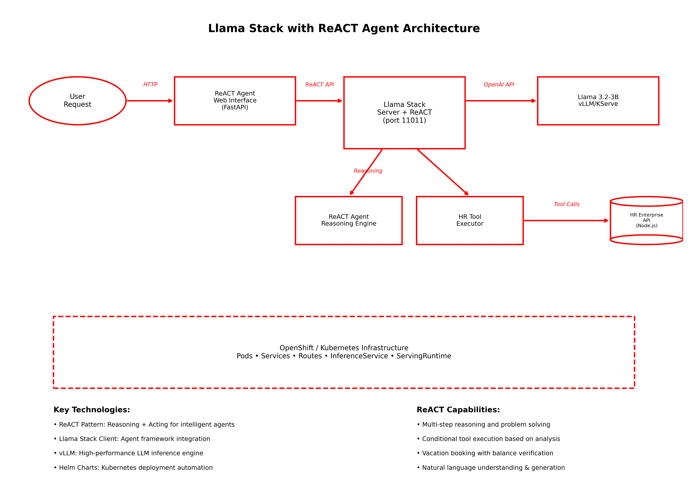

# Llama Stack with ReACT Agent

Welcome to the Llama Stack with ReACT Agent Kickstart!

Use this to quickly deploy Llama 3.2-3B or Llama 4 Scout on vLLM with Llama Stack and ReACT agents in your OpenShift AI environment.

To see how it's done, jump straight to [installation](#install).

## Table of Contents

1. [Description](#description)
2. [Architecture diagrams](#architecture-diagrams)
3. [References](#references)
4. [Prerequisites](#prerequisites)
   - [Minimum hardware requirements](#minimum-hardware-requirements)
   - [Required software](#required-software)
   - [MachineSet considerations](#machineset-considerations)
   - [Required permissions](#required-permissions)
5. [Install](#install)
   - [Clone the repository](#clone-the-repository)
   - [Create the project](#create-the-project)
   - [Build and deploy the helm chart](#build-and-deploy-the-helm-chart)
6. [Test](#test)
   - [Verification](#verification)
7. [Cleanup](#cleanup)
   - [Option 1: Remove umbrella chart](#option-1-remove-umbrella-chart-if-using-single-command-installation)
   - [Option 2: Delete the entire project](#option-2-delete-the-entire-project)
8. [ReACT Agent Implementation](#react-agent-implementation)
9. [How ReACT Agents Work with Llama Stack](#how-react-agents-work-with-llama-stack)
   - [Agent Initialization](#agent-initialization)
   - [Tool Execution Flow](#tool-execution-flow)

## Description

This kickstart provides a complete setup for deploying:
- Llama 3.2-3B or Llama 4 Scout model using vLLM on OpenShift AI
- Llama Stack for ReACT agent-based interactions
- ReACT Agent implementation with reasoning and tool execution capabilities
- Sample HR application providing RESTful services for HR data e.g. vacation booking
- MCP Integration with HR API for tool-based vacation management

## Architecture diagrams



## References

- [Llama Stack Documentation](https://rh-aiservices-bu.github.io/llama-stack-tutorial/)
- [Llama Stack ReACT Tutorial](https://rh-aiservices-bu.github.io/llama-stack-tutorial/modules/elementary-02-react.html)
- [ReACT: Synergizing Reasoning and Acting in Language Models](https://arxiv.org/abs/2210.03629)
- [vLLM Documentation](https://github.com/vllm-project/vllm)
- [Red Hat OpenShift AI Documentation](https://access.redhat.com/documentation/en-us/red_hat_openshift_ai)


## Prerequisites

### Minimum hardware requirements

- 1 GPU required for Llama 3.2-3b (NVIDIA L40, A10, or similar), 4 GPUs required for Llama 4 Scount (NVIDIA L40S)
- 8+ vCPUs
- 24+ GiB RAM

### Required software

- Red Hat OpenShift
- Red Hat OpenShift AI 2.16+
- OpenShift CLI (`oc`) - [Download here](https://docs.openshift.com/container-platform/latest/cli_reference/openshift_cli/getting-started-cli.html)
- Helm CLI (`helm`) - [Download here](https://helm.sh/docs/intro/install/)

### MachineSet considerations

When deploying GPU-accelerated models, you'll need to ensure your OpenShift nodes have the appropriate GPU resources and taints/tolerations configured.

#### GPU Node Taints

Your GPU nodes should be tainted to ensure only GPU workloads are scheduled on them:

**For NVIDIA A10G nodes (Llama 3.2-3B):**
```yaml
taints:
- effect: NoSchedule
  key: nvidia.com/gpu
  value: NVIDIA-A10G-SHARED
```

**For NVIDIA L40S nodes (Llama 4 Scout):**
```yaml
taints:
- effect: NoSchedule  
  key: nvidia.com/gpu
  value: NVIDIA-L40S-SHARED
```

#### Model Tolerations

The Helm charts automatically configure the appropriate tolerations for each model:

**Llama 3.2-3B tolerations** (requires 1 GPU):
```yaml
tolerations:
- effect: NoSchedule
  key: nvidia.com/gpu
  value: NVIDIA-A10G-SHARED
```

**Llama 4 Scout tolerations** (requires 4 GPUs):
```yaml
tolerations:
- effect: NoSchedule
  key: nvidia.com/gpu
  value: NVIDIA-L40S-SHARED
```

#### Example MachineSet Configuration

Here's an example MachineSet configuration for GPU nodes:

```yaml
apiVersion: machine.openshift.io/v1beta1
kind: MachineSet
metadata:
  name: gpu-machineset
  namespace: openshift-machine-api
spec:
  replicas: 2
  selector:
    matchLabels:
      machine.openshift.io/cluster-api-machineset: gpu-machineset
  template:
    metadata:
      labels:
        machine.openshift.io/cluster-api-machineset: gpu-machineset
    spec:
      taints:
      - effect: NoSchedule
        key: nvidia.com/gpu
        value: NVIDIA-L40S-SHARED  # or NVIDIA-A10G-SHARED for A10G nodes
      providerSpec:
        value:
          # Your cloud provider specific configuration
          # Include GPU instance types (e.g., g5.xlarge, p4d.24xlarge)
```

**Note:** Adjust the `value` field in the taint to match your specific GPU type. The models will only schedule on nodes with matching taints.

### Required permissions

- Standard user. No elevated cluster permissions required

## Install

**Please note before you start**

This example was tested on Red Hat OpenShift 4.17.30 & Red Hat OpenShift AI v2.19.0.

All components are deployed using Helm charts located in the `helm/` directory:
- `helm/llama3.2-3b/` - Llama 3.2-3B model on vLLM
- `helm/llama4-scout/` - Llama 4 Scout model on vLLM
- `helm/llama-stack/` - Llama Stack server
- `helm/react-agent/` - ReACT Agent implementation
- `helm/hr-api/` - HR Enterprise API
- `helm/custom-mcp-server` - An MCP Server to connect to the HR API
- `helm/llama-stack-react/` - Umbrella chart for single-command deployment

### Clone the repository

```bash
git clone https://github.com/rh-ai-kickstart/llama-stack-react-agent.git && \
    cd llama-stack-react-agent/
```

### Create the project

```bash
oc new-project llama-stack-react-demo
```

### Build and deploy the helm chart

Deploy the complete Llama Stack with ReACT agent using the umbrella chart

To deploy with the default model Llama 3.2-3b:

```bash

# Build dependencies (downloads and packages all required charts)
helm dependency build ./helm/llama-stack-react

# Deploy everything with a single command
helm install llama-stack-react ./helm/llama-stack-react 

```

or alternatively, to deploy the Llama4 scout model run:

```bash
  helm install llama-stack-react ./helm/llama-stack-react \
    --set llama3-2-3b.enabled=false \
    --set llama4-scout.enabled=true \
    --set llama-stack.llamaStack.inferenceModel=llama4-scout \
    --set llama-stack.llamaStack.vllmUrl="http://llama4-scout-predictor:8080/v1"
```

**Note:** The `llama-stack` pod will be in `CrashLoopBackOff` status until the Llama model is fully loaded and being served. This is normal behavior as the Llama Stack server requires the model endpoint to be available before it can start successfully.

This will deploy all components including:
- Llama 3.2-3B or Llama 4 Scout model on vLLM
- Llama Stack server with ReACT agent support
- ReACT Agent implementation
- HR Enterprise API  
- Web interface for agent interaction

Once the deployment is complete, you should see:

To get the Streamlit interface URL:
```bash
  export INTERFACE_URL=$(oc get route react-agent -o jsonpath='{.spec.host}' 2>/dev/null || echo "Route not found")
  echo "ReACT Agent Streamlit Interface: https://$INTERFACE_URL"
```

To check the status of all components:
```bash
  helm status llama-stack-react
  oc get pods 
```

For troubleshooting:
```bash
  oc get pods
  oc logs -l app.kubernetes.io/name=llama-stack
  oc logs -l app.kubernetes.io/name=llama3-2-3b
  oc logs -l app.kubernetes.io/name=react-agent
  oc logs -l app.kubernetes.io/name=hr-enterprise-api
```

When the deployment is complete, you should see all pods running in your OpenShift console:


## Test

1. Get the ReACT Agent Streamlit interface route:
```bash
oc get route llama-stack-react-react-agent
```

2. Open the Streamlit interface URL in your browser (it will look something like `https://llama-stack-react-react-agent-react-demo.apps.openshift-cluster.company.com`)

3. **Configure the Streamlit Interface**:
   - In the sidebar, set Host: `llama-stack` and Port: `80`
   - Click "🔌 Connect to Llama Stack"
   - Wait for the "✅ Connected to Llama Stack" message

4. **Test ReACT Agent Reasoning and Tool Usage**:

In the Streamlit interface, try these complex queries to test the ReACT reasoning capabilities:

**Test 1: Conditional vacation booking**
```
If user EMP001 has enough remaining vacation days, book two days off for 2nd and 3rd of July 2025
```

**Test 2: Vacation balance inquiry**
```
What is the vacation balance for employee EMP001?
```


The Streamlit interface will show:
- 🤔 **Reasoning steps** in yellow boxes as the agent thinks through problems
- 🛠️ **Tool executions** in green boxes when calling HR MCP server
- ✅ **Results** in blue boxes with the outcomes and decisions
- 💭 **Conversation history** showing the complete interaction

This demonstrates the ReACT agent's ability to:
- Reason through multi-step problems
- Use tools conditionally based on previous results
- Provide comprehensive responses with step-by-step thinking


### Verification

Verify that your ReACT agent is working correctly:

```bash
# Check all pods are running
oc get pods

# Check the ReACT agent logs
oc logs -l app.kubernetes.io/name=react-agent

# Test the service connectivity
oc exec -it deployment/llama-stack -- curl http://react-agent:8501/_stcore/health

## Cleanup

To remove all components from OpenShift:

### Option 1: Remove umbrella chart (if using single command installation)
```bash
# Remove the complete deployment
helm uninstall llama-stack-react
```

### Option 2: Delete the entire project
```bash
# Delete the project and all its resources
oc delete project llama-stack-react-demo
```

This will remove:
- Llama 3.2-3B vLLM deployment
- Llama Stack services
- ReACT Agent implementation
- HR Enterprise API
- Agent interface
- All associated ConfigMaps, Services, Routes, and Secrets

## ReACT Agent Implementation

The ReACT agent implementation (`react-agent/`) demonstrates how to build intelligent agents that can reason through problems and use tools dynamically. This simplified implementation provides:

- **Step-by-Step Reasoning**: Uses ReACT (Reasoning + Acting) pattern to think through problems
- **HR MCP Integration**: Uses the HR MCP server tools for vacation management
- **Simple Command Line Interface**: Easy to run and test examples
- **Conditional Logic**: Makes intelligent decisions based on data analysis

The ReACT agent connects to Llama Stack and uses HR MCP server tools for vacation operations.

**Quick Start - Streamlit Web Interface**: 
```bash
cd react-agent/
pip install -r requirements.txt
streamlit run streamlit_app.py
# Open http://localhost:8501 in your browser
```

**Source Code**: See the complete source code in the `react-agent/` directory. The main web interface is in `streamlit_app.py` and the core agent logic is in `simple_agent.py` - based on the weather MCP example but updated for HR operations.

## How ReACT Agents Work with Llama Stack

### Agent Initialization

ReACT agents are initialized using the Llama Stack client with MCP tool definitions. The agent connects to the Llama Stack server and configures available MCP tools. Here's how ReACT agents are configured:

```python
from llama_stack_client import LlamaStackClient
from llama_stack_client.lib.agents.react.agent import ReActAgent

# Initialize client and agent
client = LlamaStackClient(base_url="http://llama-stack:11011")
agent = ReActAgent(
    client=client,
    model="llama3.2:3b-instruct",
    tools=["mcp::hr-api-tools"],  # HR MCP server
    response_format={
        "type": "json_schema",
        "json_schema": ReActOutput.model_json_schema(),
    },
    sampling_params={
        "strategy": {"type": "top_p", "temperature": 1.0, "top_p": 0.9},
    }
)
```

When a ReACT agent starts, it:
1. **Connects to Llama Stack** via HTTP client
2. **Discovers MCP tools** available through the HR MCP server
3. **Initializes reasoning capabilities** for step-by-step problem solving
4. **Creates sessions** for handling user interactions

### Tool Execution Flow

When a user makes a request to a ReACT agent, here's the complete reasoning and execution flow:

1. **User Request**: User asks a complex question (e.g., "If user EMP001 has enough remaining vacation days, book two days off for 2nd and 3rd of July 2025")

2. **Agent Session**: ReACT agent creates a new session and begins reasoning process

3. **Reasoning Phase**: The agent thinks through the problem step by step:
   - "I need to check EMP001's vacation balance first"
   - "Then I need to determine if they have enough days available"
   - "If yes, I should book the requested dates"

4. **Tool Selection**: Based on reasoning, the agent decides which tools to use and in what order

5. **Tool Execution**: The agent executes MCP tools sequentially:
   - Calls HR MCP server tools to check vacation balance
   - Analyzes the result to determine if booking is possible
   - Calls HR MCP server tools to book the vacation days

6. **Result Integration**: The agent incorporates tool results into its reasoning

7. **Final Response**: The agent provides a comprehensive answer based on all gathered information

This ReACT pattern allows the agent to think through complex multi-step problems and execute actions intelligently based on real-time data.